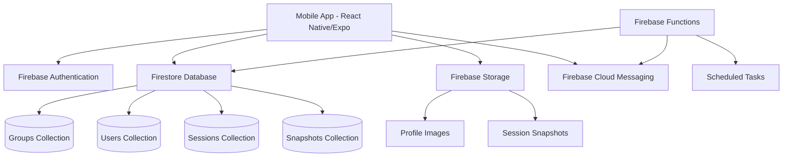
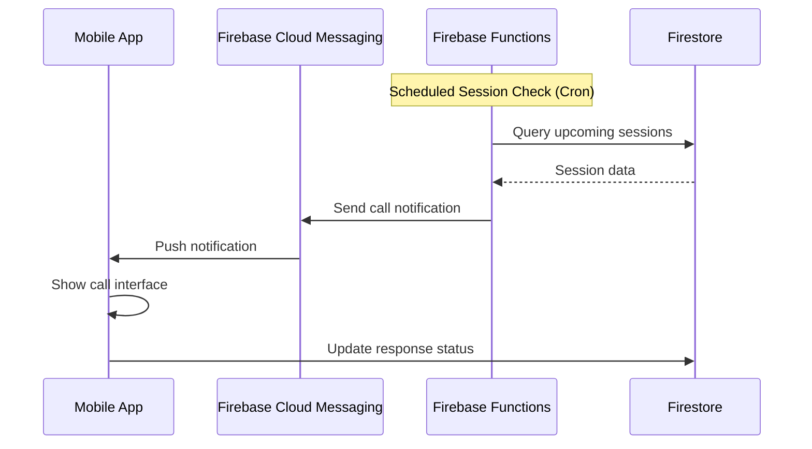

# 設計書

## 概要

Buddy Callは、Expo/React Nativeを使用したクロスプラットフォームモバイルアプリケーションです。Firebase をバックエンドとして使用し、リアルタイム通信、認証、データ保存、プッシュ通知機能を提供します。アプリは小規模グループでの目標達成支援に特化し、自動通知、リアルタイム写真共有、グループ管理機能を核とした設計になっています。

## アーキテクチャ

### 技術スタック

**フロントエンド:**
- React Native 0.79.6 + Expo SDK 53
- TypeScript
- Expo Router (ファイルベースルーティング)
- React Navigation
- Expo Camera (写真撮影)
- Expo Notifications (プッシュ通知)

**バックエンド:**
- Firebase Authentication (ユーザー認証)
- Firestore Database (リアルタイムデータベース)
- Firebase Storage (画像保存)
- Firebase Cloud Messaging (プッシュ通知)
- Firebase Functions (サーバーサイドロジック)

**状態管理:**
- React Context API (認証状態)
- React Hooks (ローカル状態)

### システム構成図



## コンポーネントとインターフェース

### 画面構成

**認証フロー:**
- `/login` - ログイン・サインアップ画面
- 認証状態に基づく自動リダイレクト

**メインアプリ (タブナビゲーション):**
- `/(tabs)/index` - ホーム画面（グループ一覧・次のセッション）
- `/(tabs)/groups` - グループ管理画面
- `/(tabs)/calendar` - スケジュール管理画面
- `/(tabs)/profile` - プロフィール・設定画面

**モーダル・詳細画面:**
- `/group/[id]` - グループ詳細・設定画面
- `/session/[id]` - アクティブセッション画面
- `/create-group` - グループ作成画面
- `/invite/[token]` - 招待リンク処理画面

### 主要コンポーネント

**GroupCard**
```typescript
interface GroupCardProps {
  group: Group;
  nextSession?: Session;
  onPress: () => void;
}
```

**SessionTimer**
```typescript
interface SessionTimerProps {
  duration: number;
  onComplete: () => void;
  isActive: boolean;
}
```

**SnapshotCapture**
```typescript
interface SnapshotCaptureProps {
  sessionId: string;
  timeLimit: number;
  onCapture: (imageUri: string) => void;
  onTimeout: () => void;
}
```

**CallNotification**
```typescript
interface CallNotificationProps {
  session: Session;
  onAccept: () => void;
  onDecline: (reason: DeclineReason) => void;
}
```

## データモデル

### Firestore コレクション構造

**users**
```typescript
interface User {
  id: string;
  email: string;
  displayName: string;
  profileImageUrl?: string;
  fcmToken: string;
  createdAt: Timestamp;
  updatedAt: Timestamp;
}
```

**groups**
```typescript
interface Group {
  id: string;
  name: string;
  description: string;
  goal: string;
  memberIds: string[];
  createdBy: string;
  inviteToken: string;
  createdAt: Timestamp;
  updatedAt: Timestamp;
}
```

**sessions**
```typescript
interface Session {
  id: string;
  groupId: string;
  scheduledAt: Timestamp;
  duration: number; // minutes (max 60)
  status: 'scheduled' | 'active' | 'completed' | 'cancelled';
  participants: {
    userId: string;
    status: 'accepted' | 'declined' | 'no_response';
    declineReason?: DeclineReason;
    joinedAt?: Timestamp;
  }[];
  createdAt: Timestamp;
  startedAt?: Timestamp;
  completedAt?: Timestamp;
}
```

**snapshots**
```typescript
interface Snapshot {
  id: string;
  sessionId: string;
  userId: string;
  imageUrl: string;
  capturedAt: Timestamp;
  isVisible: boolean;
}
```

**notifications**
```typescript
interface NotificationLog {
  id: string;
  userId: string;
  type: 'session_call' | 'snapshot_request' | 'session_summary';
  sessionId: string;
  sentAt: Timestamp;
  respondedAt?: Timestamp;
  response?: string;
}
```

### 列挙型

```typescript
enum DeclineReason {
  ON_TRAIN = 'on_train',
  EMERGENCY = 'emergency',
  SICK = 'sick',
  BUSY = 'busy',
  OTHER = 'other'
}

enum SessionStatus {
  SCHEDULED = 'scheduled',
  ACTIVE = 'active',
  COMPLETED = 'completed',
  CANCELLED = 'cancelled'
}
```

## エラーハンドリング

### エラー分類と対応

**ネットワークエラー:**
- オフライン状態の検出と適切なUI表示
- 再接続時の自動同期
- キャッシュされたデータの表示

**権限エラー:**
- カメラ権限の要求と拒否時の代替フロー
- 通知権限の要求と設定画面への誘導
- 位置情報権限（将来の機能拡張用）

**認証エラー:**
- トークン期限切れの自動更新
- ログアウト処理とログイン画面への遷移
- 認証失敗時のエラーメッセージ表示

**データエラー:**
- Firestoreの読み書きエラーハンドリング
- 画像アップロード失敗時のリトライ機能
- データ整合性チェックとエラー回復

### エラー処理パターン

```typescript
// カスタムエラークラス
class BuddyCallError extends Error {
  constructor(
    message: string,
    public code: string,
    public recoverable: boolean = true
  ) {
    super(message);
  }
}

// エラーハンドリングフック
const useErrorHandler = () => {
  const showError = (error: BuddyCallError) => {
    // エラー表示ロジック
  };
  
  const handleError = (error: unknown) => {
    if (error instanceof BuddyCallError) {
      showError(error);
    } else {
      // 予期しないエラーの処理
    }
  };
  
  return { handleError };
};
```

## テスト戦略

### テストレベル

**ユニットテスト:**
- ユーティリティ関数のテスト
- カスタムフックのテスト
- データ変換ロジックのテスト

**コンポーネントテスト:**
- React Testing Libraryを使用
- ユーザーインタラクションのテスト
- 状態変更のテスト

**統合テスト:**
- Firebase接続のテスト
- 認証フローのテスト
- データ同期のテスト

**E2Eテスト:**
- Detoxを使用した主要フローのテスト
- 通知機能のテスト
- カメラ機能のテスト

### テスト環境

**開発環境:**
- Firebase Emulator Suite
- モックデータとモック関数
- テスト用のFirebaseプロジェクト

**CI/CD:**
- GitHub Actions
- 自動テスト実行
- テストカバレッジレポート

## セキュリティ考慮事項

### データ保護

**Firestore セキュリティルール:**
```javascript
rules_version = '2';
service cloud.firestore {
  match /databases/{database}/documents {
    // ユーザーは自分のデータのみアクセス可能
    match /users/{userId} {
      allow read, write: if request.auth != null && request.auth.uid == userId;
    }
    
    // グループメンバーのみグループデータにアクセス可能
    match /groups/{groupId} {
      allow read, write: if request.auth != null && 
        request.auth.uid in resource.data.memberIds;
    }
    
    // セッション参加者のみセッションデータにアクセス可能
    match /sessions/{sessionId} {
      allow read, write: if request.auth != null && 
        exists(/databases/$(database)/documents/groups/$(resource.data.groupId)) &&
        request.auth.uid in get(/databases/$(database)/documents/groups/$(resource.data.groupId)).data.memberIds;
    }
  }
}
```

**画像セキュリティ:**
- Firebase Storage セキュリティルール
- 画像の自動削除（30日後）
- 画像サイズとファイル形式の制限

**通信セキュリティ:**
- HTTPS通信の強制
- Firebase SDK の自動暗号化
- 機密データのクライアントサイド暗号化

### プライバシー保護

**データ最小化:**
- 必要最小限のデータのみ収集
- 不要になったデータの自動削除
- ユーザー同意に基づくデータ処理

**アクセス制御:**
- グループベースのアクセス制御
- 招待トークンの有効期限設定
- 管理者権限の適切な管理

## パフォーマンス最適化

### データ取得最適化

**Firestore クエリ最適化:**
- 複合インデックスの適切な設定
- ページネーションの実装
- リアルタイムリスナーの効率的な使用

**画像最適化:**
- 画像の自動リサイズ
- WebP形式での保存
- 遅延読み込みの実装

### メモリ管理

**React Native 最適化:**
- 不要なリレンダリングの防止
- メモリリークの防止
- 大きなリストの仮想化

**キャッシュ戦略:**
- 画像キャッシュの実装
- オフラインデータの適切な管理
- キャッシュサイズの制限

## 通知システム設計

### プッシュ通知フロー



### 通知タイプ

**セッション開始通知:**
- 通話風のフルスクリーン通知
- 応答・辞退ボタン
- 自動タイムアウト（30秒）

**スナップショット要求通知:**
- アクション可能な通知
- 制限時間の表示
- カメラ直接起動

**セッション結果通知:**
- 不在メンバーへの結果共有
- 画像プレビュー付き
- アプリ内詳細表示への誘導

## 今後の拡張性

### 機能拡張の考慮

**追加機能の準備:**
- 音声通話機能の統合準備
- ビデオ通話機能の統合準備
- ゲーミフィケーション要素の追加

**スケーラビリティ:**
- マイクロサービス化の準備
- データベース分割の計画
- CDN導入の検討

**国際化対応:**
- 多言語対応の準備
- タイムゾーン対応
- 地域別機能の差別化